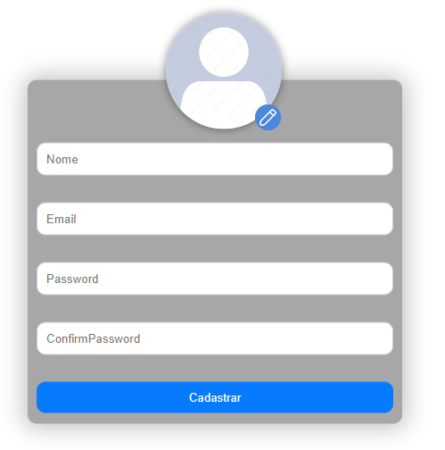

# TwinstaGram

Este repositório contém o projeto TwinstaGram, uma rede social desenvolvida como parte da disciplina de Programação para Web. O projeto foi construído com o framework Adonis.

## Descrição

TwinstaGram é uma rede social inspirada no Twitter, permitindo aos usuários fazer postagens, curtir e comentar. Além disso, os usuários podem seguir uns aos outros para ver as postagens em seus feeds.

## Instalação e Execução

1. **Criar a pasta temporária para o banco SQLite**
    ```
    mkdir tmp
    ```

2. **Criar o .env**
    ```
    cp .env.example .env
    ```

3. **Instalar as dependências**
    ```
    npm install
    ```

### **Execução**
    node ace serve --watch

## Funcionalidades Principais

- Autenticação de usuários
- Upload de imagens 
- Criar Posts
- Interação por meio de curtidas
- Sistema de seguidores e feed 

## Tecnologias Utilizadas

- AdonisJS: Framework Node.js para construção da aplicação
- Banco de dados SQLite
- Outras tecnologias e bibliotecas conforme necessário

## Estrutura do Repositório

### Pasta `socialdev`

A pasta `socialdev` contém a estrutura principal do projeto AdonisJS. Aqui está uma explicação detalhada de cada pasta:

- `/app`: Contém a lógica principal da aplicação, incluindo Models, Controllers, Services e Validators. É onde a maior parte do código do projeto é desenvolvida.
  
- `/database`: Armazena as migrações e as sementes do banco de dados, permitindo a configuração e inicialização do esquema do banco de dados.

- `/public`: Mantém arquivos estáticos acessíveis ao público, como imagens, estilos CSS e scripts JavaScript.

- `/resources`: Contém as views da aplicação, onde o código HTML e os templates são desenvolvidos usando a sintaxe do Adonis.


## Telas do Projeto

Este projeto contém diversas telas que compõem a interface da aplicação. Abaixo estão algumas capturas de tela representativas:

### Tela de Login


- A tela de login é onde o usuário informa os dados para entrar em sua conta. É nessa tela também que é exibido o botão de criar conta.

### Home


- A home é exbida assim que o usuário faz login. Na Home é listado todos os posts publicados no TwinstaGram.
- É possível curtir os posts ou entrar no perfil dos autores do post

### Perfil


- A tela de configurações oferece opções para personalizar preferências, segurança e privacidade da conta.

### Lista de curtidas do post


### Dark Mode


- Tela com o Dark Mode ativado.


